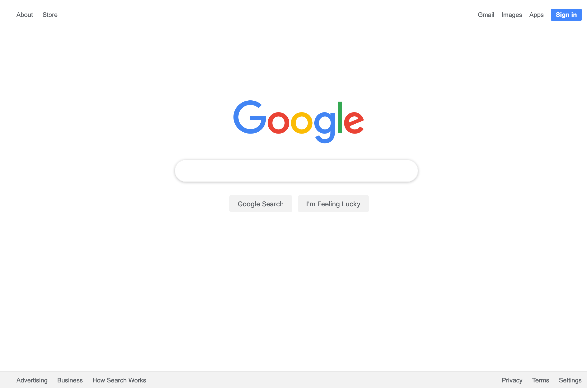

# google-homepage

Here's a screenshot of the Google home page project I completed for <a href="https://www.theodinproject.com/" target="_blank"> The Odin Project</a>. I am unsure how to get that cursor inside the search box, as well as the search icon. The tutorials I've tried online didn't seem to work, so something in my code may be overidding it. Overall, I am happy I was able to push this project out with such limited knowledge of CSS. I have done some minor HTML work in the past, but that knowledge was gained in the late 90s so I did a refresher course using <a href="https://www.codecademy.com/catalog/language/html-css" target="_blank">CodeAcademy</a> and <a href="https://www.freecodecamp.org/" target="_blank">FreeCodeCamp</a>. My preference being <a href="https://www.freecodecamp.org/" target="_blank">FreeCodeCamp</a> as I felt it provided more in depth learning than <a href="https://www.codecademy.com/catalog/language/html-css" target="_blank">CodeAcademy</a>. It's a great little project idea to help build some confidence to move forward with. 
